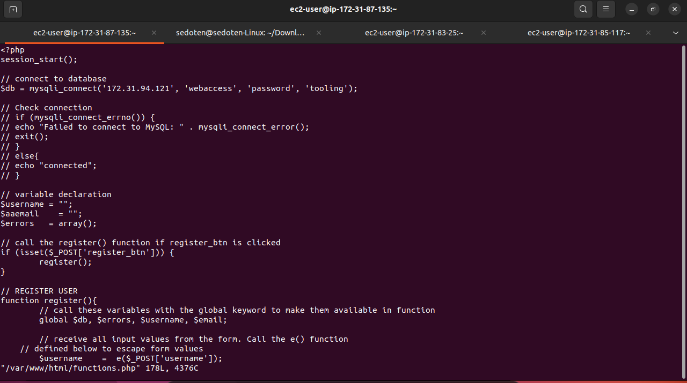

# DEVOPS TOOLING WEBSITE SOLUTION
This project aims to setup a devops tooling webssite solution using LAMP stack with remote database and NFS servers. 

The project uses a common configuration where several stateless web servers share a common database and also access the same files using Network File System (NFS) as a shared file storage. Althoug NFS server might be located on a seperate hardware, from the point of view of the web servers it seems more like a local file system from where they can serve the same files.

The diagram below shows the architecture of implemented project.


This project consists of the following components:
* Infrastructure:   AWS
* Webserver Linux:  Red Heart Enterprise Linux 8 (3 instances)
* Database Server: Ubuntu 20.04 + MySQL
* Storage Server: Red Hat Enterprise Linux 8 + NFS Server
* Programming Language: PHP
* Code Repository: GitHub 

The three web servers, one database server and NFS server (which was accompanied by 3  EBS volumes) were launched as instances on AWS. 


For the NFS server, I mounted the 3 volumes and created the required partitionws using:
```bash
    lsblk #to check if the attached volumes
    # The gdisk command to configure the partitions and choosing the necessary options
    sudo gdisk /dev/xvdf
    sudo gdisk /dev/xvdf
    sudo gdisk /dev/xvdf
```


I confirmed that the partitions have been created.


I installed lvm2 and created the physical volumes.


Afterwards, I created the volume group named "webdata-vg" and created the three (3) logical volumes from the volume group namely:
* lv-apps
* lv-logs
* lv-opt


I checked the configurations of the volumes to confirm it met expectations using the command:
```bash
    sudo vgdisplay -v
```


I formatted the three disks using xfs system 


i created the 3 mount points required and mounted each logical volume as required.


After completing the disk configuration, I installed NFS server using the following commands:
```bash
    sudo yum -y update
    sudo yum install nfs-utils -y
    sudo systemctl start nfs-server.service
    sudo systemctl enable nfs-server.service
    sudo systemctl status nfs-server.service
```


I exported the mounts of the webservers' subnet cidr after obtaining it from AWS console.


Thereafter, I setup the necessary permissions required to allow the web servers read, write and execute files on NFS using the following commands:
```bash
    sudo chown -R nobody: /mnt/apps
    sudo chown -R nobody: /mnt/logs
    sudo chown -R nobody: /mnt/opt
    sudo chmod -R 777 /mnt/apps
    sudo chmod -R 777 /mnt/logs
    sudo chmod -R 777 /mnt/opt
    sudo systemctl restart nfs-server.service
```

I configured access to NFS for clients within the same subnet 


I also opened ports TCP 111, UDP 111, UDP 2049 to allow client access to the NFS server. 


I installed mysql on the database server and created a database named **tooling**, a database user named **webaccess** and granted permission to **webaccess** user to manipulate **tooling** database from the web server subnet cidr.


## PREPARING THE WEB SERVERS
I worked on the configuration of the web server to ensure it can serve the same content from the shared storage solutions available in NFS server and Mysql database.

Firstly, I installed the NFS client using  the command:
```bash
    sudo yum install nfs-utils nfs4-acl-tools -y
```


Afterwards, I mounted the NFS on /var/www 
```bash
    sudo mkdir /var/www
    sudo mount -t nfs -o rw,nosuid <NFS-Server-Private-IP-Address>:/mnt/apps /var/www
```
and confirmed that it was mounted in the directory and I also confirmed that a file created in the /var/www directory reflects on the NFS server in /mnt/apps .


I ensured that the mount would start on reboot by including it in /etc/fstab 


i installed Remi repository (a free repo with cutting edge latest software versions not readily avaiable in the OS repo by default), Apache and PHP.

```bash
    sudo yum install httpd -y

    sudo dnf install https://dl.fedoraproject.org/pub/epel/epel-release-latest-8.noarch.rpm

    sudo dnf install dnf-utils http://rpms.remirepo.net/enterprise/remi-release-8.rpm

    sudo dnf module reset php

    sudo dnf module enable php:remi-7.4

    sudo dnf install php php-opcache php-gd php-curl php-mysqlnd

    sudo systemctl start php-fpm

    sudo systemctl enable php-fpm

    sudo setsebool -P httpd_execmem 1
```
I repeated the steps taken to configure the first webserver on the remaining two with a few snapshots of the process below:


I located the log folder for Apache on the webserver and mounted it to NFS server's export for logs as well as include it in the /etc/fstab to ensure the mount point persists after reboot.  


I installed git on the web servers using 
```bash
    sudo yum install git
```
and cloned the **tooling repo** for the project on the servers. 


Afterwards, I ensured that the html folder from the cloned repo is deployed to /var/www/html in all the three (3) web servers.


I disabled SELinux in the web servers 


I configure database server by adding tooling database.


I updated the website's configuration to connect to the database.




I logged in to the website successfully.


